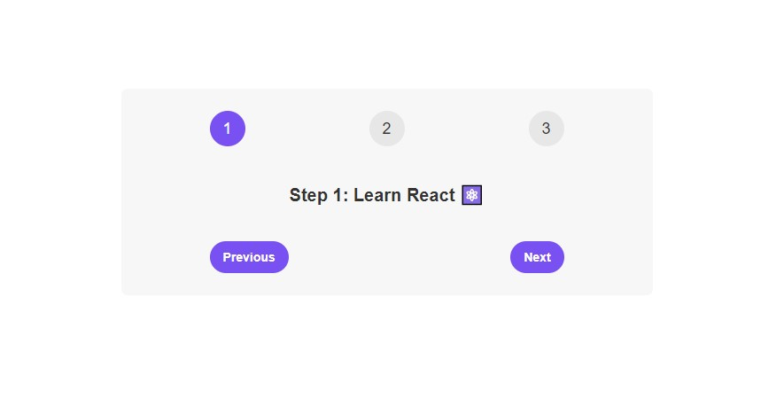

# Steps

## Table of contents

- [Overview](#overview)
  - [The challenge](#the-challenge)
  - [Screenshot](#screenshot)
  - [Links](#links)
- [My process](#my-process)
  - [Built with](#built-with)
  - [What I learned](#what-i-learned)
  - [Continued development](#continued-development)
- [Author](#author)

## Overview

### The challenge

Users should be able to:

- View the optimal layout for the app depending on their device's screen size
- Press button elements to change state

### Screenshot

### Links

- Live Site URL: [View](https://steps2.netlify.app/)

## My process

- This React application comprises an App component rendering two instances of the Steps component.
- Each Steps component manages its state using useState to track the current step and toggle its visibility.
- The Steps component displays step numbers, corresponding messages, and navigation buttons based on its internal state.
- Clicking the "Previous" button decreases the step number if the current step is greater than 1, and clicking "Next" increases the step number if the current step is less than 3.
- The component's content is conditionally rendered based on the isOpen state, allowing collapsible step-by-step display within each instance of the Steps component.

### Built with

- Semantic HTML5 markup
- CSS custom properties
- Mobile-Responsive Design
- JavaScript - Scripting language
- [React](https://reactjs.org/) - JS library

### What I learned

This was a class project to learn about useState. I finally truly understand it now. This also touch on opening component to input children.

### Continued development

Maybe used for reference.

## Author

- Website - [Cameron Howze](https://camkol.github.io/)
- Frontend Mentor - [@camkol](https://www.frontendmentor.io/profile/camkol)
- GitHub- [@camkol](https://github.com/camkol)
- LinkedIn - [@cameron-howze](https://www.linkedin.com/in/cameron-howze-28a646109/)
- E-Mail - [cameronhowze4@outlook.com](mailto:cameronhowze4@outlook.com)
